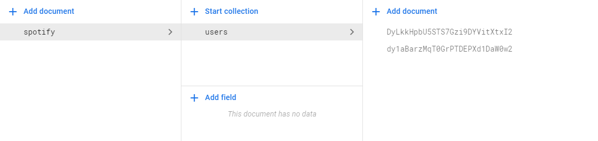

<div align="center">
    
    <h1>LavaStore</h1>
    <p>A flexible and scalable local <em>Firestore-like</em> database for the web</p><br>
    
    
    <br/>
    
    
</div>


## About

LavaStore is structured like the Firestore database system with Documents and Collections.


## Install

LavaStore can be installed using npm (or directly downloaded from the official GitHub repo).

```bash
npm i lavastore
```
View the project on [NPM](https://www.npmjs.com/package/lavastore) or [GitHub](https://github.com/WilliamRagstad/LavaStore).


## Usage

**Documents** contains **sub-collections** and **fields** *(data)*, and **Collections** contains **sub-documents**.

Always start with creating a `new LavaStore('my_store')` class and give it a unique ID. The next step is to either setup a store document and collection structure using either the `InsurePath()` method, or chained `Add()` methods. Alternatively, use `SetPath()` if you already have data to store in a specific subdocument.

The image below is an example of an Firestore structure which is easily replicatable locally using LavaStore.



Here, **spotify** is a document containing no data but a **users** collection, where user-related data might be stored between sessions.


## Examples
The code below initializes a new LavaStore document root called `app`. When first running this code in the browser, we'll see a empty object being logged, but after a reload it contains the data `{ value: "Test" }`.

```typescript
import { LavaStore } from "lavastore";

const AppDocument = new LavaStore("app");

console.log(AppDocument.Get());

AppDocument.Set({
    value: "Test"
});
```

But LavaStore can do so much more than store data. It can organize data, and even be a strong foundation for your very own NoSQL database if you'd like.


## Specification

| Description  | Value |
| ------------ | ----- |
| Package Size | 24 kB |
| Semi-colons  | ~80   |

### Public API

#### LavaStore

This is a regular **LSDocument** with the only exception that it strictly must be root of a Document/Collection tree.

#### LSDocument

```typescript
class LSDocument {
    id: string;
    parent: LSCollection | undefined;
    Collection(id: string): LSCollection | undefined;
    Contains(id: string): boolean;
    Add(collection: LSCollection): void;
    Remove(id: string): void;
    InsurePath(path: string | string[]): void;
    Load(): void;
    Save(): void;
    Set(data: object): void;
    Get(): object;
    HasData(): boolean;
    SetPath(path: string | string[], data: object): void;
    GetPath(path: string | string[]): object;
    CollectionPath(path: string | string[]): LSCollection;
    DocumentPath(path: string | string[]): LSDocument;
    PassTo(callback: ((data: object) => any)): void;
}
```

#### LSCollection

```typescript
class LSCollection {
    id: string;
    parent: LSDocument | undefined;
    Contains(id: string): boolean;
    Document(id: string): LSDocument | undefined;
    Add(document: LSDocument): void;
    Remove(id: string): void;
}
```


## Want to help?

All help is verry much appreciated! You can fork the repo right now and start building your own modified version right away, and if you happen to create something interesting and useful, don't hesitate to file a pull request!

### Sponsor this project

You can also help by supporting the project financially, all gifts are appreciated with great reverence and gratitude.

Developer: [paypal.me/williamragstad](http://paypal.me/williamragstad)
